# studentinformation
Student registration and information portal using PHP, MySQL

This web based application system will be a Student Registration System for a student of the university as well as the administrator of the application. This system will be designed to register students for the particular semesters in the various courses offered by the University. It shall provide a one stop place for students to register, view and edit their details as well as the admin for viewing all students in the course and edit student and course information, which would have been much difficult with paper work and files. By maximizing the student’s and admin’s work efficiency, the system will meet the university’s needs and requirements while remaining easy to understand and use.
The system also contains a relational database containing a list of courses with their maximum limit, All student details, and hostel details.

For running this project on your PC and local setup, follow following steps-
1.	Install latest version of xampp on your PC.
2.	Run apache and mysql from its control panel. If there is any port clash issue, resolve it so that its runs without errors.
3.	Paste this folder under your xampp/htdocs folder
4.	Open localhost/phpMyAdmin, create a new database with the name student. Check user for the database- on localhost, username root and no password.
5.	Now import the given .sql file in the database. Make sure it’s imported without errors.
6.	Open localhost/studentinformation, the homepage should be visible. Use the example student login details- enrolmentid- GH1234 and password-12345678 to check the update form. Admin login details- username- 0000 password-amu_reg
7.	If you have any issues, please contact me.

Improvements needed to this project and Extra features to be implemented by me for my university-
1. Styling bugs removed.
2. Styling of the student details form is improved as shown in the Software Design Document.
3. Admin login table created in the database instead of hardcoding in php.
4. Added student photo in the generated pdf as well
5. Add image details in the image table of the database for better mapping
6. Admin login added for- Year wise, class wise, division wise, Gender wise, cast wise, category wise, religion wise, 
                       age wise student list created and maintained using this portal, print and export to excel.

For all other details please check the SRS and SDD documents.

Thanks!

Overall Description

2.1	Product perspective

Figure 1 - System Environment use case

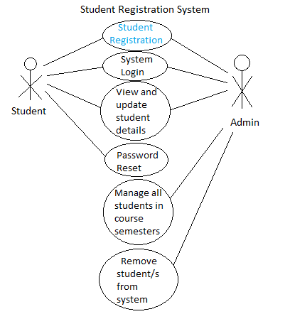

	The Student Registration System has two active actors and one cooperating system. 
The student can register to a course for a particular semester, view and update his/her information through this system. The admin can view all students enrolled in a particular course of the University for the particular semester, add or remove and student/s, search any student and view and update his/her details. There is a link to the (existing) Courses table in the database.

2.1	Product Functions
Context diagram –

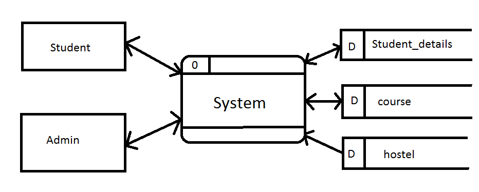

2.2	Operating Environment
The application should run on any machine with Windows OS.
2.3	Design and Implementation Constraints
It is required to implement this web application on Php and mysql database along with an appealing user interface and should be cross browser compatible
3.	External Interface Requirements
3.1	User Interfaces
The GUI interface below will each give an idea of the requirements on each interface of the user and messages to display

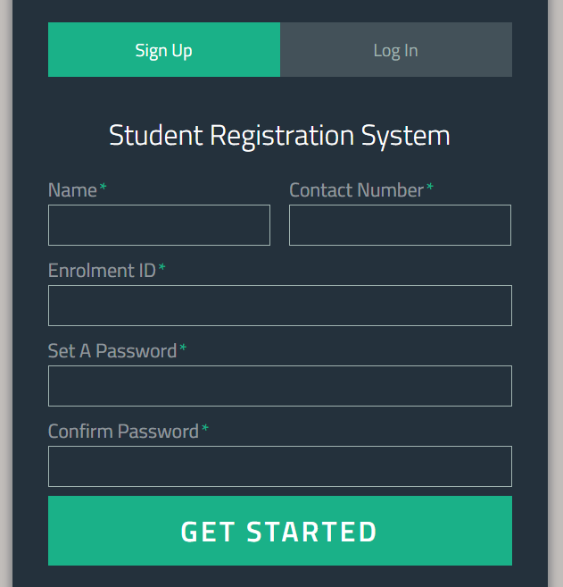

An interface for signing up into the system for a student. This should be the home page. It should take inputs as shown in the figure

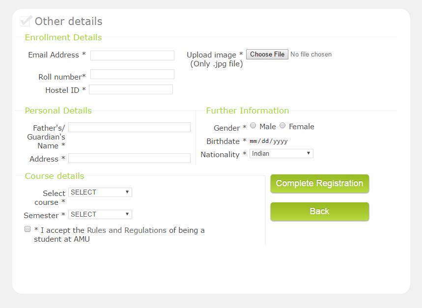

A next interface to complete registering other details and registering in a sem of a course.
After successfully completing registration, the system should open up a pdf with confirmation message and other details.

 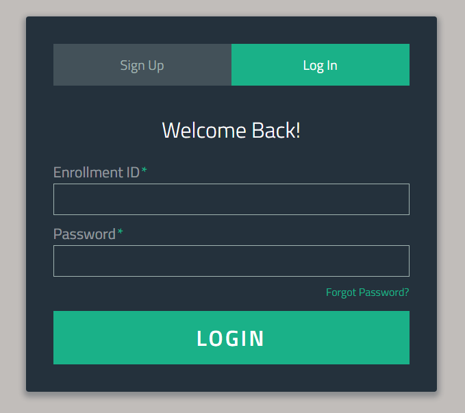
 
An interface for logging into the system for registered students using enrolment id and password

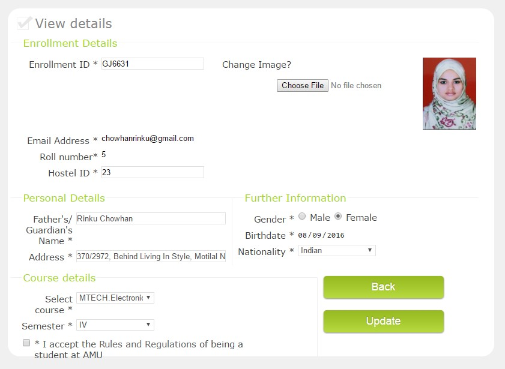

After logging into the system, the student should be able to view his/her details and be able to edit the information.

 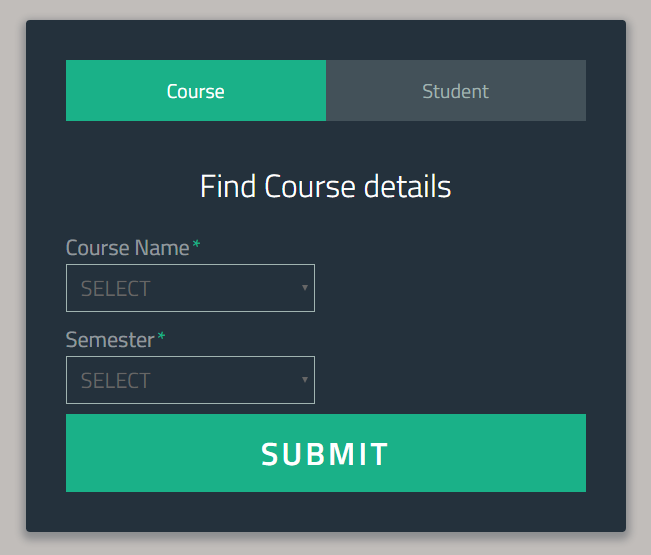
 
This is the page for the admin. The admin should be able to view all the enrolled students in a particular course for the particular semester.

 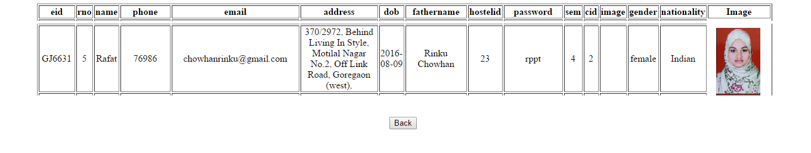
 
The result can be shown in this way.

 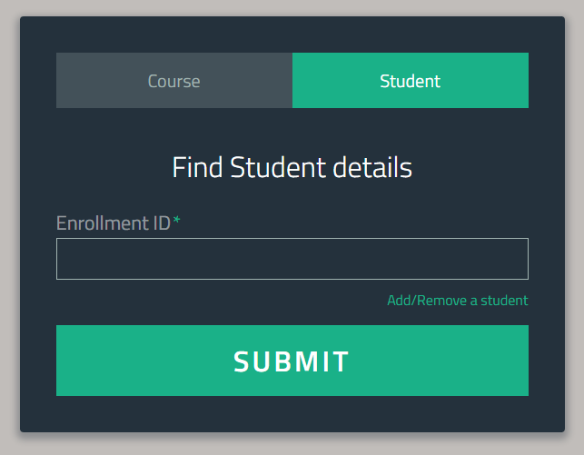
 
The interface for the admin to search and view details of a particular student. After this the admin should be able to similarly be able to edit the student’s details.

 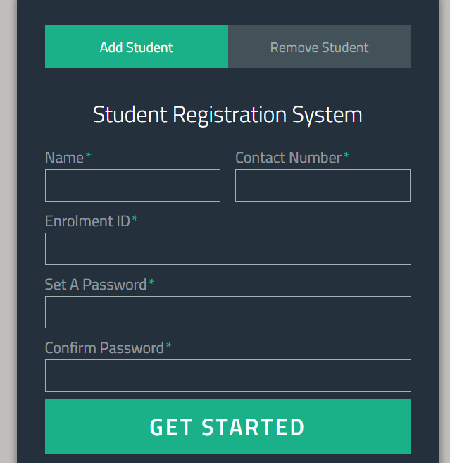
 
An interface is to be provided to the admin to register a student similarly.

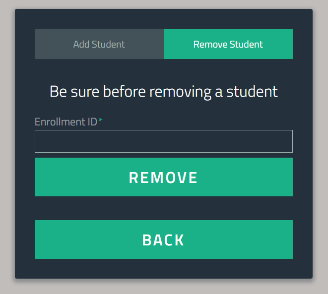

Admin should also be able to delete a student from the system in case of fraudulent or mistaken registrations/sign ups
ER diagram of the students' data stored in the Database is-

 
 
